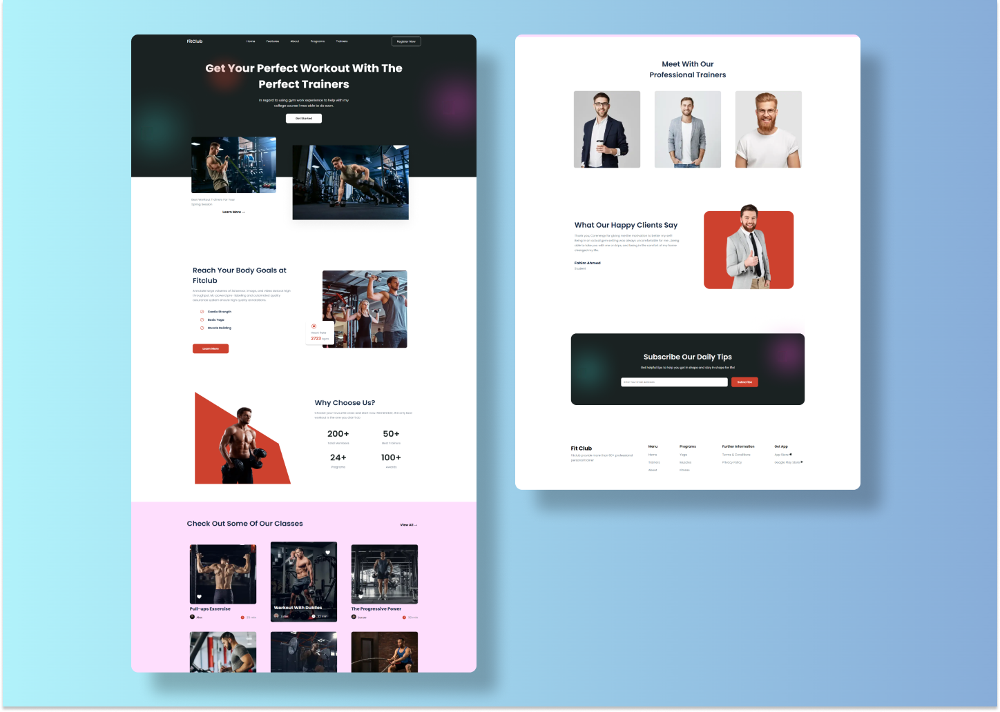

# FitClub &mdash; LandingPage 🏋️‍♀️



FitClub is a landing page to show services, trainers and programs for a fitness club gym. It has seven sections and it's completely responsive. 

All CSS code was written following BEM methodology. It is used both grid and flex technology in each section. Furthermore, most of the section has animations and transitions.

## ***Technologies and Tools*** 

  * HTML5
  * CSS3
  * Javascript
  * SASS
  * Gulp

This website is available in: 
```
  https://fitclusrsn.netlify.com
```

## ***Considerations***

This script is just for compile SASS code into CSS code, as well as minifying css code
```
  npm run g-compile
```

If you want to turn jpg, jpeg, png images into webp, avif images. And to minify your images.
```
  npm run g-images
```

This script executes g-images and then g-compile scripts
```
  npm run gulp
```